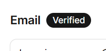

# Kiwi Farmers Work Flow

This document is meant to be a breakdown of the workflow expected for all members of Kiwi Farmers. This may also be used to relay messages and tasks to be done in future. All future messages must be formatted in proper markdown formatting. For documentation on proper formatting practices, please visit [Markdownguide.org](https://www.markdownguide.org/cheat-sheet/)

---
## Work Flow

These steps are to be followed whenever you intend to contribute this GitHub repository;

    1. Before starting, always remember to pull the repository to keep your files up to date.
        - Clone or Pull the repo into the themes folder in your Wordpress installation

    2. Preform the work you intend to do

    3. When you would wish to commit to the repository, inform your teammates of your intention to
    commit.
        - If a teammate has committed something to the repository during the duration of you working, 
        remember to Pull the repository again to ensure there are no merge conflicts
    
    4. Repeat Steps 2 and 3 for as long as you intend to work

These steps are to be followed to help prevent any issues that may arise from merge conflicts. There is no worse feeling in the world that working hard on something just for it to go to waste, so to reduce and prevent this possibility for happening

**Work flow may be subject to change to fit the needs of the project**

---

## Recent Messages
### Rodney Russell (02/04/2026, 13:02)
Good afternoon, Rodney here! The rest of my duties have been stylizing the website and fixing up some previous development hurdles for more efficient work. So far i've been tinkering with the header and replaced WordPress's universal styles with a proper style.css. Very soon i'll be adding a basic css grid system to keep consistant spacing and alignment throughout the website. Kevin is currently working on SEO and has fixed much of the code for accessability and best practices. We are on the final stretch in completing the website and i look forward to seeing the final product in public.

### Rodney Russell (26/03/2026, 12:43)
It's time to make my first post! I've spent about 15 hours in total figuring out why something as basic as ACF/SCF would not work. Following the previous lab lesson on the plugin led me nowhere. After trying almost a dozen different solutions, I found one that works! I downloaded the plugin CodeSnippets and made a function that create it's own shortcode to use. I then created a form that loads wherever that shortcode is added to an admin-only page. By filling out the form and pressing submit, SCF automatically creates a new post, displays the details on the custom post with the new shortcodes, and redirects you to that post to view it. This is a "if it works, don't touch it" scenario. All that's left is to style it to fit the website. In the end, I'm proud I was able to achieve such a solution despite how easy ACF should be. I'm no longer convinced that Hostinger itself is preventing the functionality of ACF/SCF plugins.

### Kevin Paradis (25/03/2026, 13:49)
Rodney has made a startling discover that may very likely put the entire website at risk. In his attempts to add ACF functionality to the posts, he discovered that Hostinger itself might be the reason for this, and we have yet to find a solution. This is exorbitantly infuriating because we were never made aware of this during our initial research.

We are hard at work attempting to find a solution to this, as we are aware that ACF is required for Capstone.

### Kevin Paradis (20/03/2026, 15:31)
With Rodney joining the development process, the website is expected to take shape even faster than before. Naturally, it took a moment to get used to needing to deal with a second developer, as I had to take some time to resolve a few merge conflicts. After learning my lesson, things will be much smoother going forward.

The images for the website have already been collected and are *mostly* ready for deployment. However the dimensions of the images will likely need to be adjusted, as they don't easily fit into the design as is.s

### Kevin Paradis (13/03/2026, 15:10)
The design is slowly coming together, but as of right now, many of the current templates are lacking images. This will be alleviated later when we take professional photos of our client's studio, and possibly the use of stock images to fill in gaps.

### Kevin Paradis (12/03/2026, 13:37)
I had a small problem with the color pallette where the -x and x colors were the same. I fixed this issue by making the slugs more distinct

### Kevin Paradis (06/03/2026, 14:36)
After spending over an hour both researching and experimenting on methods to automatically connect this GitHub repo to our hosting service has failed. I was able to find 3 separate methods to make this connection, and none of them worked.

Method one asked me to navigate to a menu in Hostinger that physically doesn't exist
Method two asked me to input a code into a terminal and add a password. Problem is that it physically wouldn't let me input anything into the password, so I wasn't able to make a connection
Lastly, method three said to use a Hostinger plugin, that of course, requires money. This is likely the best option of doing this, but I'm uncomfortable paying for anything without client approval

For the time being, we will likely be updating the theme manually on the hosting service, as to not bog down development with fruitless research and experimentation

### Kevin Paradis (05/03/2026, 14:02)
Something has been plaguing development for the last week, and it's come to a point where we're basically out of things to do to solve the problem. When we purchased hosting at last week's meeting, we attempted to connect the domain name we bought a month prior, but we weren't able to do so. Apparently, the domain name we purchased was "Suspended", and has been since we bought it. For some reason, it claims the email we used for the domain name isn't verified. We used the client's business email, and we made sure to verify the email during that meeting.

Thankfully, our hosting appears to be working, as we were able to host a blank website under a temporary domain name. We'll attempt to use this for the time being until we can resolve the domain name issue, which we found we can change after 60 days after initial purchase (Jan 22), so the earliest we can fix this is March 22nd.

We're still in the process of getting *something* up on our hosting service for today's meeting, but tension is rather high due to frustration, as both of us are confused and annoyed that this happened in the first place.

### Kevin Paradis (27/02/2026, 13:10)
Yesterday we had a very productive meeting with our client. Our biggest point was successfully paying for web hosting with Hostinger, having solved the issue that plagued us previously. Along with that, we got approval for our high fidelity design and got revisions on the content for the website. 

Rodney is still hard at work finishing the high fidelity design, and we couldn't be happier with how it came out. We're excited to share our design with our peers come Monday. As for myself, I'm adding the requested revisions to the biography and services the client provided me. I'll likely spend the remainder of this week fixing those and getting them ready for publication.

We're still in the process of getting the website fully online with the domain we secured. This will be our primary task on Monday, to get the website up and operational in time for our team meeting on Thursday.

Expect next week to see a massive spike in development activity, as we're finally able to progress to the next stage of development.

### Kevin Paradis (23/02/2026, 12:58)
Hey... it's been a while, huh?

Yeah, so development on the site has basically completely halted due to not having a finalized design. It'd be quite a waste of time to be working on a design we don't have finalized, and would need to go back and redo repeatedly. As a result, in case the severe lack of updates to the repository isn't obvious, we haven't made any additions to the theme.

However, don't let the lack of development lead you to believe we have been doing nothing (aside for during reading week, naturally). Rodney has been putting his nose to the grindstone working on the final design, while I have been busy researching and preparing content to eventually fill out the website as soon as the design is ready to be implemented.

Thus far, I have researched and written about every service our client provides, and have written a biography about the client. I sent the first draft of the biography to the client for feedback and approval earlier today, and I intend to spend time recompiling the services research into a slightly more interesting block of text, to steer away from what is currently an uninteresting block of text.

Development will resume eventually, and I hope as soon as I am given the green light, I can rapidly implement everything I have been writing over the past 2-3 weeks.

### Kevin Paradis (05/02/2026, 14:08)
We have recently completed some more user testing of our low fidelity wire frame. We're compiling our notes into a spreadsheet, and we are pleased with the feedback we have received. With this information, Rodney will further refine the high fidelity design into something we will deliver to the client for feedback and approval. In the mean time, I will be working on the WordPress installation, doing things like adding pages and posts to fit the requirements of the site, as well as test navigation between these pages and posts.

We also replaced screenshot.png with a more appropriate image of the logo of Top Asian Massage. No more crusty land shark ;-;

### Kevin Paradis (02/02/2026, 13:31)
It was decided that instead of making a Classic theme, we will be making a Block theme with Full Site Editing. This will significantly benefit development as we have much more familiarity using Block themes as opposed to Classic themes. With this change, we intend to speed up development by specializing in areas of WordPress we have stronger knowledge, hopefully cutting down on the amount of time wasted on fist fighting with a Classic theme when a Block theme will work with little fuss. These changes will be pushed by the end of this work period.

### Kevin Paradis (30/01/2026, 14:57)
screenshot.png is a placeholder image used for the skeleton structure of the classic theme. This image is to be replaced with a more appropriate image later in production.

